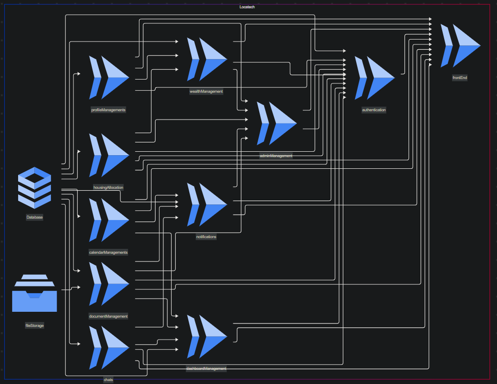
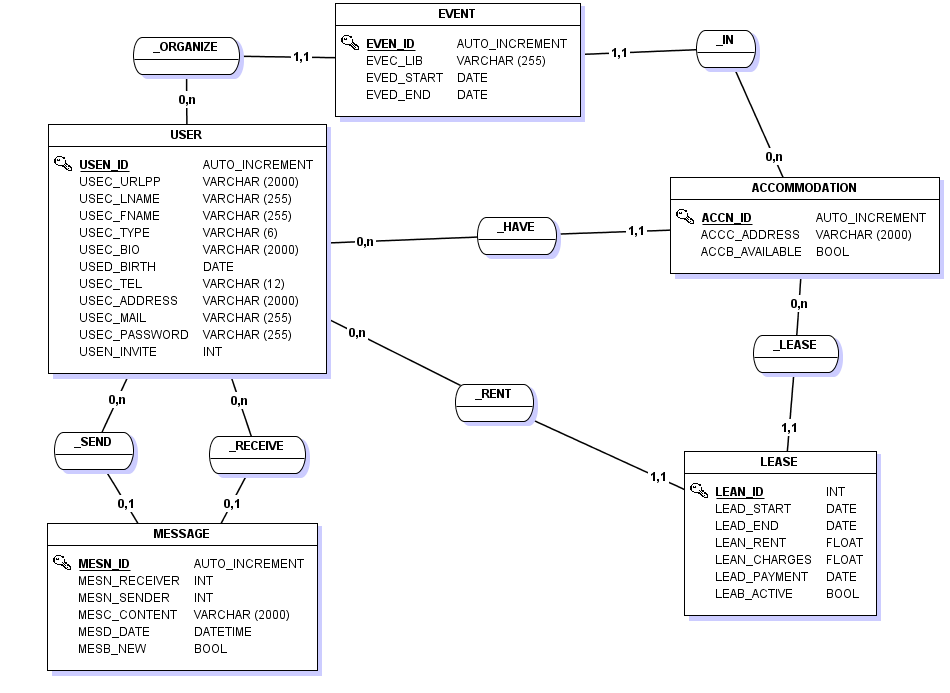

# LocaCCM

## Présentation du projet (10 lignes)
(DYLAN)

## Composition de l'équipe
 - **Dynastie AMOUSSOU** => QA & développement du micro-service (https://github.com/locaccm/dashboardManagement)
 - **Leo LOMEL** => QA & développement du micro-service (https://github.com/locaccm/chat)
 - **Axel BOUTEILLER** => Scrum Master & développement du micro-service (https://github.com/locaccm/wealthManagement)
 - **Clement FOULON** => DevOps & développement du micro-service (https://github.com/locaccm/housingAllocation)
 - **Matthieu MARIN** => Architecte Cloud & développement du micro-service (https://github.com/locaccm/authentication)
 - **Dylan TATIN** => Developpeur front-end (https://github.com/locaccm/frontEnd) & développement du micro-service (https://github.com/locaccm/notification)
 - **Mosleh SNOUSSI** => Developpeur front-end (https://github.com/locaccm/frontEnd) & développement du micro-service (https://github.com/locaccm/adminManagement)
 - **Maxime CAUWET** => DevOps & développement du micro-service (https://github.com/locaccm/profileManagement)
 - **Tom DEHAME** => Producteur Owner & développement du micro-service (https://github.com/locaccm/documentManagement)

## Présentation de la CI/CD

Dans le cadre de notre projet de développement de microservices pour une plateforme de gestion propriétaire/locataire, nous mettrons en place une chaîne d'intégration et de déploiement continus (**CI/CD**). Cette section détaillera les outils et les étapes du pipeline permettant d'assurer un déploiement efficace et sécurisé sur **Google Cloud Run**.

---

## **Objectifs du CI/CD**

L'objectif principal du CI/CD sera d'automatiser le cycle de vie des microservices afin de garantir :

- **Une intégration continue** : Vérifier la qualité du code et détecter les erreurs le plus tôt possible.
- **Un déploiement continu** : Mettre à jour automatiquement les services après validation des modifications.
- **Une infrastructure as code** : Gérer l’ensemble du déploiement via **Terraform** pour garantir une infrastructure stable et reproductible.

---

## **Outils utilisés**

Pour atteindre ces objectifs, nous adopterons les outils suivants :

- **GitHub Actions** : Permettra d'automatiser les différentes étapes du pipeline CI/CD, telles que les tests, la construction des images Docker et le déploiement sur **Google Cloud Run**.

- **ESLint** : Un outil de vérification du code qui s'exécutera lors de chaque **Pull Request (PR)**. Il imposera le respect du **camelCase**, l'utilisation de **Prettier** pour le formatage, et garantira un code propre et maintenable.

- **SonarCloud** : Analyseur statique du code qui évaluera la qualité du code source. Nous définirons un seuil de **80%** de qualité minimum pour qu'une PR puisse être validée.

- **Docker & Google Artifact Registry** : Tous les microservices seront conteneurisés à l'aide de **Docker**, et les images seront stockées dans **Google Artifact Registry**, facilitant ainsi leur gestion et leur distribution.

- **Terraform** : Outil d’Infrastructure-as-Code permettant de gérer et de déployer les services sur **Google Cloud Run**, en définissant leur configuration de manière déclarative.

- **Google Cloud Run** : Plateforme serverless sur laquelle nos microservices seront exécutés. Elle permettra une **scalabilité automatique**, sans gestion de serveurs.

- **Google Cloud IAM** : Utilisé pour gérer les permissions d'accès aux services **Cloud Run**, en définissant quelles entités pourront invoquer ou administrer les microservices.

---

## **Architecture du Pipeline CI/CD**

Chaque microservice suivra le pipeline suivant :

1. **Push sur la branche `develop`**
   - Déclenchement automatique du pipeline GitHub Actions.

2. **Intégration continue (CI) sur `develop`**
   - Vérification du formatage du code avec **ESLint**.
   - Analyse statique de la qualité du code avec **SonarCloud**.
   - Vérification de la présence d'un **Dockerfile** dans le dépôt.
   - Construction de l’image Docker du microservice.

3. **Merge vers la branche `main`**
   - Validation du code et des tests.

4. **Déploiement continu (CD) sur `main`**
   - Push de l’image Docker dans **Google Artifact Registry**.
   - Déploiement du service sur **Google Cloud Run** via **Terraform**.
   - Mise à jour des permissions d’accès et des variables d’environnement.

5. **Vérification et Monitoring**
   - Vérification du bon fonctionnement via des tests automatisés post-déploiement.
   - Suivi des logs et des performances via **Google Cloud Logging & Monitoring**.

---

## **Déploiement de l'Infrastructure avec Terraform**

Afin d’assurer un déploiement reproductible et évolutif, nous utiliserons **Terraform** pour gérer notre infrastructure. Chaque microservice disposera d’un fichier de configuration Terraform permettant de :

- Créer un **Cloud Run** spécifique pour le service.
- Gérer les accès avec **Google Cloud IAM**.
- Configurer les connexions aux autres services (base de données, stockage, etc.).

### **Lien entre Terraform et Docker**

À l'aide de **Terraform**, la gestion du **Dockerfile** devra suivre les étapes suivantes :

1. **Vérifier la présence du Dockerfile** dans le dépôt.
2. **Construire l’image Docker** depuis le Dockerfile.
3. **Pousser l’image Docker** vers **Google Artifact Registry**.

Ensuite, **Terraform** interviendra pour :

- **Récupérer l'image Docker** stockée dans Google Artifact Registry.
- **Déployer l’image sur Google Cloud Run**.

Cette approche garantira une séparation claire entre la **construction** de l’image et son **déploiement**.

---

## **Suivi et monitoring du déploiement**

Une fois les microservices déployés, il sera essentiel d'assurer leur bon fonctionnement et d'optimiser leurs performances. Pour cela, nous mettrons en place plusieurs mécanismes de supervision et d’alerte.

### **Tests automatisés post-déploiement**

Ces tests permettront de vérifier que chaque service fonctionne comme prévu après son déploiement. Ils incluront :

1. **Tests API** :
   - Automatisation des tests des endpoints.
   - Vérification des codes de réponse, des formats et des temps de latence.
   - Validation des permissions et des accès aux ressources protégées.

2. **Tests de base de données** :
   - Exécution de requêtes pour valider l'intégrité des données.
   - Vérification des connexions et du bon fonctionnement des migrations de schéma.
   - Validation des changements dans la structure des bases de données.

3. **Tests d'intégration** :
   - Mise en place de tests pour s’assurer du bon fonctionnement des interactions entre microservices.
   - Simulations de scénarios utilisateur et validation des échanges de données entre les services.
   - Tests des interactions avec des services externes pour garantir des réponses cohérentes.

4. **Tests de charge** :
   - Simulation de requêtes simultanées pour observer les performances.
   - Définition de seuils de performance pour identifier les goulets d’étranglement.
   - Mesure des temps de réponse sous différentes charges et ajustement des ressources si nécessaire.

Ces tests seront automatisés et intégrés dans le pipeline CI/CD via **GitHub Actions**, garantissant ainsi une validation continue après chaque déploiement.

## Schéma de l'architecture micro-service

## Schéma de l'architecture base de donnée

## Liste des services GCP utilisés et estimation du coût

## "Mode d'emploi"
Tuto sur les différents utilisation de votre app  
(à faire au fil de l'eau au fur et à mesure des mise en prod)

## Conseil
Viser plus petit et fonctionnel que gros et pas fini

